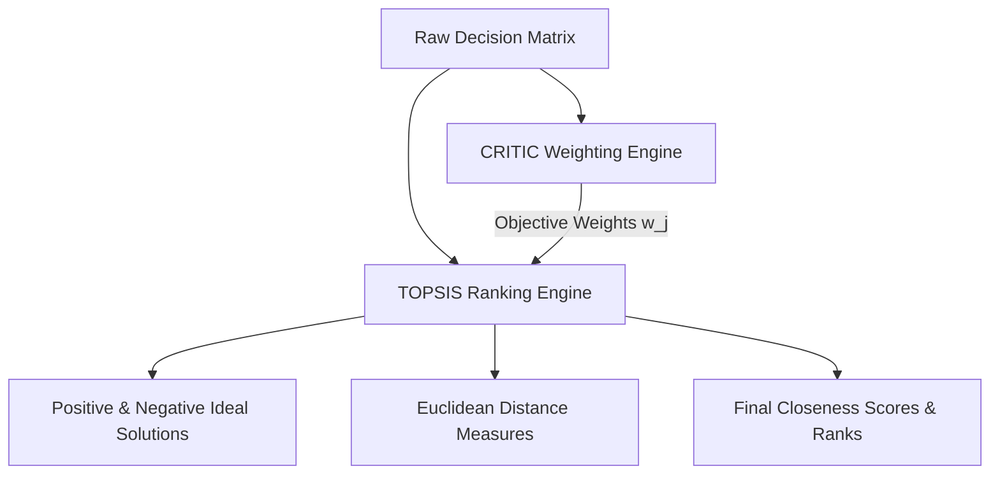
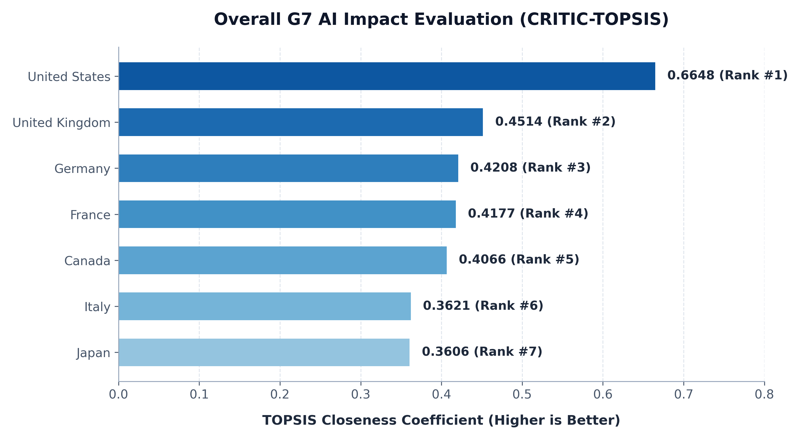
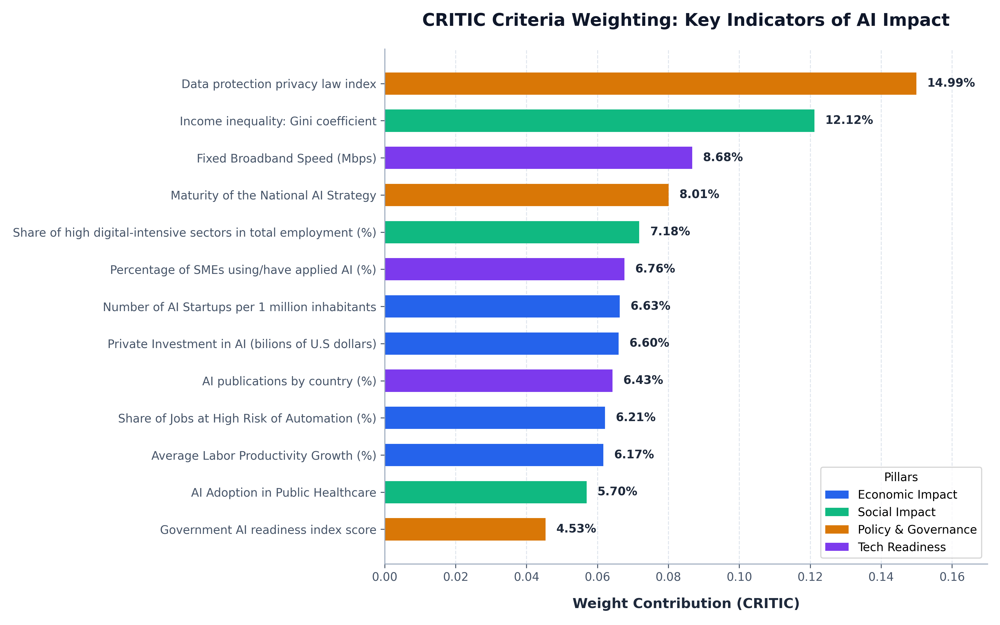
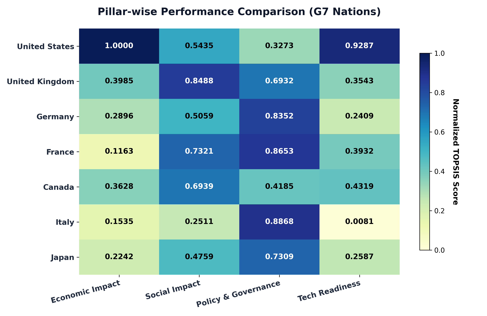
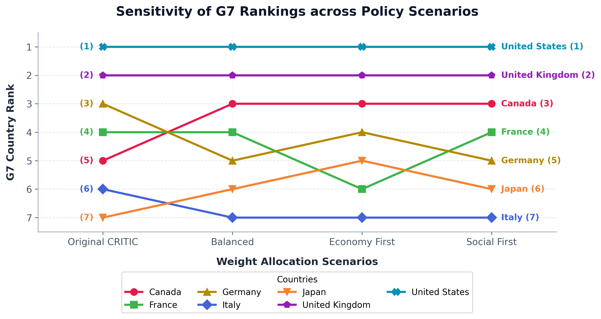

# G7 AI Impact Evaluation using MCDM (CRITIC-TOPSIS)

This repository contains a **Decision Science** project evaluating and ranking the impact of Artificial Intelligence (AI) on the G7 nations (**Canada, France, Germany, Italy, Japan, United Kingdom, United States**). 

The evaluation uses a Multiple-Criteria Decision-Making (**MCDM**) approach combining the **CRITIC** method for objective weight calculation with the **TOPSIS** method for final ranking.

---

## 📌 Project Overview

Artificial Intelligence is reshaping global economies, labor markets, and governance structures. This project assesses G7 countries across **13 key criteria** grouped into **4 analytical pillars**:

| Pillar | ID | Criterion | Type | Year | Data Source / Proxy |
| :--- | :--- | :--- | :--- | :--- | :--- |
| **Economic Impact** | C1 | Private Investment in AI ($ billions) | Benefit | 2025 | AI Index Report (Page 253) |
| | C2 | Number of AI Startups per 1 million inhabitants | Benefit | 2025 | Tracxn / Population Data |
| | C3 | Average Labor Productivity Growth (%) | Benefit | 2017-22| Conference Board / OECD |
| | C4 | Share of Jobs at High Risk of Automation (%) | Cost | 2019 | OECD Job Risk Index |
| **Social Impact** | C5 | Employment in high digital-intensive sectors (%) | Benefit | 2018 | OECD Employment Database |
| | C6 | Income inequality: Gini coefficient | Cost | 2020 | Our World in Data |
| | C7 | AI Adoption in Public Healthcare | Benefit | 2023 | GOV.UK / Health Surveys |
| **Policy & Governance**| C8 | Maturity of the National AI Strategy | Benefit | 2023 | A Cluster Analysis of AI Strategies|
| | C9 | Data protection privacy law index | Benefit | 2025 | Global Privacy Law Report |
| | C10| Government AI readiness index score | Benefit | 2025 | Oxford Insights |
| **Tech Readiness** | C11| Fixed Broadband Speed (Mbps) | Benefit | 2025 | Speedtest Global Index |
| | C12| AI publications by country (%) | Benefit | 2025 | Scopus / AI Index Report |
| | C13| Percentage of SMEs using/have applied AI (%) | Benefit | 2025 | National SME Surveys |

---

## 🛠️ Mathematical Methodology

The project integrates **CRITIC** for objective criteria weight calculation and **TOPSIS** for ranking.



### 1. CRITIC Weighting Method
The **Criteria Importance Through Intercriteria Correlation (CRITIC)** method determines objective weights based on two core concepts:
*   **Contrast Intensity**: Measured by the standard deviation of normalized criteria.
*   **Conflict between Criteria**: Measured by correlation coefficients between criteria.

#### Step 1.1: Normalization
For a decision matrix of $m$ alternatives and $n$ criteria, the elements are normalized:
$$\text{For Benefit Criteria: } \quad x_{ij}^* = \frac{x_{ij} - x_j^{\min}}{x_j^{\max} - x_j^{\min}}$$
$$\text{For Cost/Non-Benefit Criteria: } \quad x_{ij}^* = \frac{x_j^{\max} - x_{ij}}{x_j^{\max} - x_j^{\min}}$$

#### Step 1.2: Standard Deviation & Correlation
Calculate standard deviation ($\sigma_j$) for each criterion and build the Pearson correlation matrix ($r_{jk}$).

#### Step 1.3: Conflict Measure
Calculate the conflict measure ($R_j$) for each criterion representing its discordance with others:
$$R_j = \sum_{k=1}^n (1 - r_{jk})$$

#### Step 1.4: Information Quantity & Weights
Calculate the information quantity ($C_j$) and the normalized weights ($w_j$):
$$C_j = \sigma_j \cdot R_j = \sigma_j \sum_{k=1}^n (1 - r_{jk})$$
$$w_j = \frac{C_j}{\sum_{k=1}^n C_k}$$

---

### 2. TOPSIS Method
The **Technique for Order of Preference by Similarity to Ideal Solution (TOPSIS)** ranks alternatives based on their geometric distance in a normalized vector space.

#### Step 2.1: Vector Normalization
The raw decision matrix elements $x_{ij}$ are normalized via vector norm:
$$r_{ij} = \frac{x_{ij}}{\sqrt{\sum_{i=1}^m x_{ij}^2}}$$

#### Step 2.2: Weighted Normalized Matrix
Apply CRITIC weights ($w_j$) to obtain weighted normalized values:
$$v_{ij} = w_j \cdot r_{ij}$$

#### Step 2.3: Positive & Negative Ideal Solutions (PIS & NIS)
Define the best ($V^+$) and worst ($V^-$) target profiles:
$$V^+ = \{v_1^+, v_2^+, \dots, v_n^+\} \quad \text{where} \quad v_j^+ = \begin{cases} \max_i v_{ij} & \text{if } j \text{ is benefit} \\ \min_i v_{ij} & \text{if } j \text{ is cost} \end{cases}$$
$$V^- = \{v_1^-, v_2^-, \dots, v_n^-\} \quad \text{where} \quad v_j^- = \begin{cases} \min_i v_{ij} & \text{if } j \text{ is benefit} \\ \max_i v_{ij} & \text{if } j \text{ is cost} \end{cases}$$

#### Step 2.4: Distance Measures
Compute the Euclidean distances of each G7 nation to the ideal profiles:
$$S_i^+ = \sqrt{\sum_{j=1}^n (v_{ij} - v_j^+)^2} \qquad S_i^- = \sqrt{\sum_{j=1}^n (v_{ij} - v_j^-)^2}$$

#### Step 2.5: Closeness Coefficient & Final Ranking
The TOPSIS score ($C_i^*$) represents the similarity to the positive ideal solution:
$$C_i^* = \frac{S_i^-}{S_i^+ + S_i^-} \quad (0 \le C_i^* \le 1)$$
Alternatives are ranked in descending order of $C_i^*$.

---

## 📊 Analytical Results

### 1. Overall and Pillar-wise Scores Dashboard
The table below displays overall G7 rankings, final TOPSIS closeness scores, and their performance within individual pillars:

| Country | Overall Rank | Overall Score | Economic Impact Rank (Score) | Social Impact Rank (Score) | Policy & Governance Rank (Score) | Tech Readiness Rank (Score) |
| :--- | :---: | :---: | :---: | :---: | :---: | :---: |
| **United States** | **1** | **0.6648** | 1 (1.0000) | 4 (0.5435) | 7 (0.3273) | 1 (0.9287) |
| **United Kingdom**| **2** | **0.4514** | 2 (0.3985) | 1 (0.8488) | 5 (0.6932) | 4 (0.3543) |
| **Germany** | **3** | **0.4208** | 4 (0.2896) | 5 (0.5059) | 3 (0.8352) | 6 (0.2409) |
| **France** | **4** | **0.4177** | 7 (0.1163) | 2 (0.7321) | 2 (0.8653) | 3 (0.3932) |
| **Canada** | **5** | **0.4066** | 3 (0.3628) | 3 (0.6939) | 6 (0.4185) | 2 (0.4319) |
| **Italy** | **6** | **0.3621** | 6 (0.1535) | 7 (0.2511) | 1 (0.8868) | 7 (0.0081) |
| **Japan** | **7** | **0.3606** | 5 (0.2242) | 6 (0.4759) | 4 (0.7309) | 5 (0.2587) |

### 2. Scenario Rank Stability (Sensitivity Analysis)
Rank stability was tested against three policy scenarios: **Economy First** (50% Econ weight), **Social First** (50% Social weight), and **Balanced** (25% equal weight across pillars):

| Country | Original CRITIC | Balanced | Economy First | Social First |
| :--- | :---: | :---: | :---: | :---: |
| **United States** | 1 | 1 | 1 | 1 |
| **United Kingdom**| 2 | 2 | 2 | 2 |
| **Canada** | 5 | 3 | 3 | 3 |
| **France** | 4 | 4 | 6 | 4 |
| **Germany** | 3 | 5 | 4 | 5 |
| **Italy** | 6 | 7 | 7 | 7 |
| **Japan** | 7 | 6 | 5 | 6 |

---

## 📈 Visualizations

### 1. Overall TOPSIS Scores
The US exhibits a dominant position, followed by a highly competitive middle tier (UK, Germany, France, Canada) and a lower tier (Italy, Japan).


### 2. CRITIC Criteria Weights
CRITIC assigns the highest weights to **Data Protection Privacy Law Index (14.99%)** and **Income Inequality (12.12%)**, as these show the highest standard deviation and conflict coefficients among G7 nations.


### 3. Pillar-wise Heatmap
A clear overview of national profiles: the US dominates in Economic and Tech pillars but scores low in Policy and Governance, whereas European nations (Italy, France, Germany) show the inverse pattern.


### 4. Scenario Sensitivity Analysis
This plot demonstrates how scaling the pillar weights impacts G7 rankings. The US and UK are completely stable at ranks 1 and 2. Canada jumps from 5th in Original CRITIC to 3rd in all other scenarios due to its strong Tech and Social foundations.


---

## 🔬 Decision Science Evaluation & Policy Discussion

An analysis of G7 countries reveals clear divergences in AI strategy and impacts:

*   **🇺🇸 United States: The Venture & Infrastructure Champion**
    The US dominates the **Economic Impact (1.0000)** and **Tech Readiness (0.9287)** pillars, driven by gargantuan venture capital inflows ($109.08B vs UK's $4.52B) and exceptional research output. However, it lags severely in **Policy & Governance (0.3273 - 7th)** due to a highly fragmented, state-level regulatory approach and ranks poorly in social equity indicators (highest Gini coefficient, 0.40).
    
*   **🇬🇧 United Kingdom: The Balanced Pragmatist**
    The UK secures the **2nd overall rank** due to its exceptionally balanced profile. It ranks **1st in Social Impact (0.8488)** (reconciling digital employment with low automation risk) and **2nd in Economic Impact (0.3985)**. The UK successfully bridges the gap between massive US-style market dynamics and structured European-style governance.

*   **🇩🇪 Germany & 🇫🇷 France: The Sovereign Policy Advocates**
    Both countries represent the European model. France ranks **2nd in Social (0.7321)** and **2nd in Policy & Governance (0.8653)**, while Germany ranks **3rd in Policy & Governance (0.8352)**. These rankings are supported by the robust implementation of the EU AI Act and strict data privacy standards (C9). However, they suffer from a venture capital deficit (7th in Economic Impact for France) and slow SME digital adoption.

*   **🇨🇦 Canada: The Underappreciated Contender**
    Canada exhibits solid foundations, ranking **2nd in Tech Readiness (0.4319)** and **3rd in Social Impact (0.6939)**. Its overall rank is dragged down to 5th under Original CRITIC because the method places heavy weight (over 27%) on Policy and Governance, where Canada lacks strategy maturity. In any alternative policy scenario (Balanced, Economy First, Social First), **Canada jumps to 3rd place overall**, showing it is highly resilient and well-rounded.

*   **🇮🇹 Italy: The Regulatory Leader with Infrastructure Deficits**
    Italy ranks **1st in Policy & Governance (0.8868)**, displaying strong regulatory standards and strategic alignment. However, it ranks **last in Tech Readiness (0.0081)** and **last in Social Impact (0.2511)**. This represents a major bottleneck: Italy has created a world-class legal framework for AI safety, but lacks the basic broadband infrastructure, AI research, and private funding to leverage it.

*   **🇯🇵 Japan: The Moderate Conservative**
    Japan ranks **7th overall (0.3606)**. While showing moderate policy readiness (0.7309), it suffers from low private investment ($0.93B) and lags in public sector healthcare AI integration. However, in an **Economy First** scenario, Japan's rank improves to **5th**, showing its economic indicators are relatively stronger than its social performance.

---

## 📂 Directory Structure

The repository is organized as follows:

```text
MCDM-G7-AI-Impact/
├── data/                             # Data files
│   ├── raw/                          # Raw datasets
│   │   ├── G7_AI_Impact_Data.xlsx    # Principal spreadsheet containing all G7 data
│   │   └── G7_AI_Impact_Criteria.json # JSON file defining criteria parameters
│   └── processed/                    # Extracted CSV datasets for scripting
│       ├── Criteria.csv              # Definitions, types, and pillars of criteria
│       ├── Data.csv                  # The G7 decision matrix (raw values)
│       └── Data_Permuted.csv         # Permuted G7 data
│
├── src/                              # Python source scripts
│   ├── data_loader.py                # Helper script to load data and criteria settings dynamically
│   ├── mcdm_solver.py                # Generic CRITIC and TOPSIS calculation engine
│   ├── step_by_step.py               # Computes and logs detailed intermediate steps of calculations
│   ├── analysis.py                   # Computes rankings within each individual Pillar
│   ├── scenario_analysis.py          # Sensitivity analysis across weight allocation scenarios
│   ├── visualization.py              # Generates geographic heatmap, bubble map, and professional charts
│   └── excel_to_json.py              # Utility to extract Excel sheets to CSV/JSON files
│
├── outputs/                          # Calculated outputs
│   ├── csv/                          # Intermediate and final CSV tables
│   │   ├── steps/                    # Detailed calculation matrix sheets
│   │   ├── analysis/                 # Pillar-specific scores
│   │   └── scenario/                 # Sensitivity results for different weight scenarios
│   ├── excel/                        # Consolidated Excel reports (.xlsx)
│   │   ├── CRITIC_TOPSIS_Methodology_Steps.xlsx
│   │   ├── Pillar_Analysis_Results.xlsx
│   │   └── Scenario_Analysis_Results.xlsx
│   └── figures/                      # Generated analytical plots (.png)
│       ├── G7_Final_Rankings.png            # [NEW] Overall TOPSIS bar chart
│       ├── CRITIC_Criteria_Weights.png      # [NEW] CRITIC weights by pillar
│       ├── G7_Pillar_Performance_Heatmap.png# [NEW] Pillar comparison heatmap
│       ├── Scenario_Sensitivity_Analysis.png# [NEW] Sensitivity line plot
│       ├── G7_AI_Investment_Map.png         # Geographic map for AI investment
│       ├── G7_AI_Share_of_Jobs_Map.png      # Geographic map for job automation risk
│       └── G7_Ranking_BubbleMap_Custom.png  # Bubble map for TOPSIS score
│
├── docs/                             # Project documentation and papers
│   ├── Figures_Description.docx      # Narrative notes on data visualization
│   └── report_AI_in_G7_nations_MCDM.pdf  # Formal academic report
│
├── run_all.py                        # Master pipeline script to execute everything sequentially
├── .gitignore                        # Files to ignore in git commits
└── requirements.txt                  # Python package dependencies
```

---

## ⚙️ Installation & Setup

1. **Clone the repository**:
   ```bash
   git clone https://github.com/your-username/MCDM-G7-AI-Impact.git
   cd MCDM-G7-AI-Impact
   ```

2. **Create a virtual environment (optional but recommended)**:
   ```bash
   python -m venv .venv
   source .venv/bin/activate  # On Windows, use `.venv\Scripts\activate`
   ```

3. **Install dependencies**:
   ```bash
   pip install -r requirements.txt
   ```

---

## 🚀 How to Run

To execute the entire calculation pipeline (data extraction, step-by-step math, pillar analysis, scenario sensitivity analysis, and plotting G7 maps/charts) with a single command, run the master script:

```bash
python run_all.py
```
